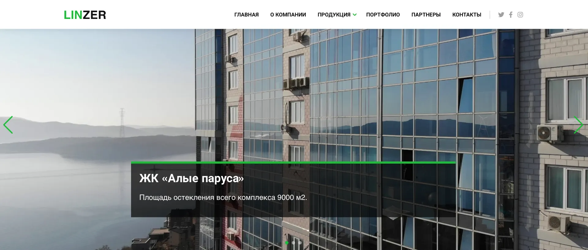

# Сайт строительной компании "Linzer"

### Описание
Многостраничный сайт компании "Linzer" переделаный в адаптивный с использованием React из старого статичного [сайта](https://linzer.su/old/).
#### Демонстрация приложения: [https://linzer.su/](https://linzer.su/)
### Стек приложения

## Работа с приложением

### в директории приложения можно использовать команды:

#### устанока необходимых пакетов для работы
#### `npm i`

#### запуск приложения в режиме разработки, необходимо перейти по ссылке  [http://localhost:3000](http://localhost:3000) для просмотра
#### `npm run start`

#### Собирает приложения для размещения в папку `build`.
#### `npm run build`
